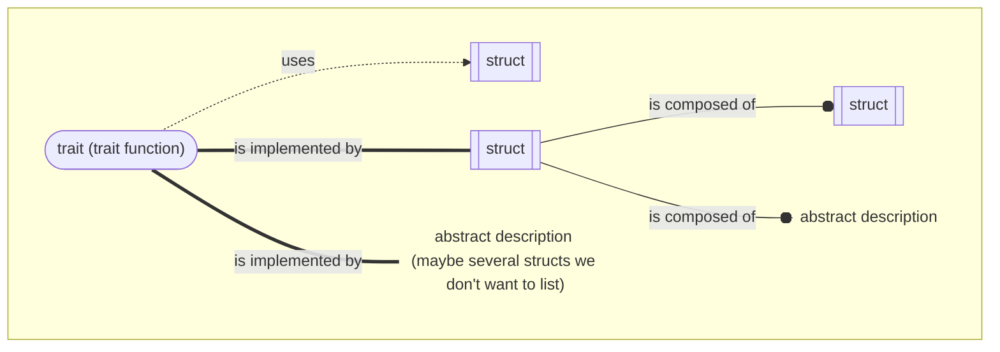
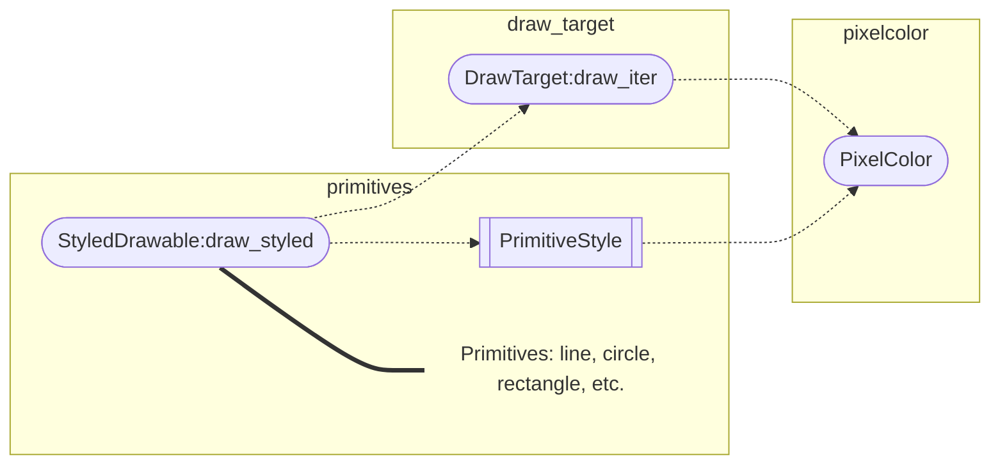
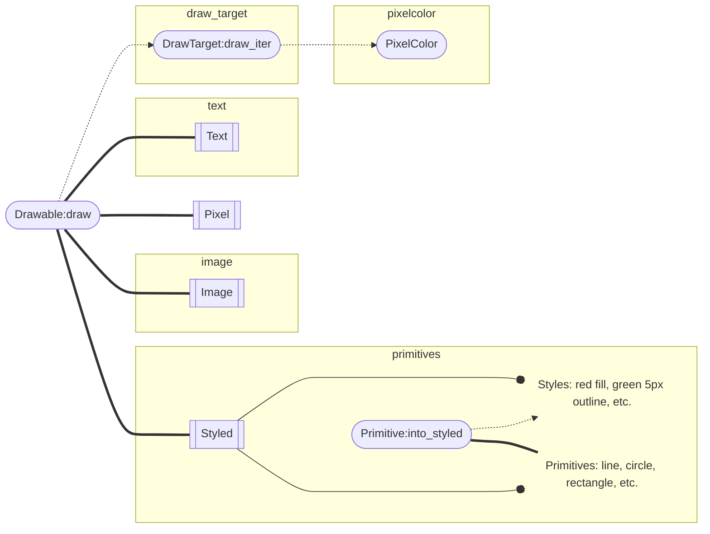

# Legend

```mermaid
graph TD;
    S1[[struct]]
    S2[[struct]]
    S3[[struct]]

    T1(["trait (trait function)"])

    I1@{ shape: text, label: "abstract description (maybe several structs we don't want to list)" }
    I3@{ shape: text, label: "abstract description" }

    subgraph Legend[ ]
        T1 -.->|uses| S1
        T1 ===|is implemented by| S2
        T1 ===|is implemented by| I1
        S2 --o|is composed of| S3 & I3
    end
```

# StyledDrawable `draw_styled`

```mermaid
graph LR
    %% structs
    PS[[PrimitiveStyle]]
    Pri@{ shape: text, label: "Primitives: line, circle, rectangle, etc." }
    
    %% traits
    DT([DrawTarget:draw_iter])
    SD([StyledDrawable:draw_styled])
    PC([PixelColor])

    %% modules
    pixelcolor[pixelcolor]
    primitives[primitives]
    draw_target[draw_target]

    %%subgraph embedded-graphics
        subgraph draw_target
            DT
        end

        subgraph primitives
            PS
            SD
            Pri
        end

        subgraph pixelcolor
            PC
        end
    %%end

    DT -.-> PC
    SD -.-> PS
    SD -.-> DT
    PS -.-> PC
    SD === Pri
```

# Drawable `draw`

```mermaid
graph LR
    %% structs
    S[[Styled]]
    Px[[Pixel]]
    Sty@{ shape: text, label: "Styles: red fill, green 5px outline, etc." }
    Pri@{ shape: text, label: "Primitives: line, circle, rectangle, etc." }
    I[[Image]]
    T[[Text]]
    
    %% traits
    DT([DrawTarget:draw_iter])
    PC([PixelColor])
    D([Drawable:draw])
    P([Primitive:into_styled])

    %% modules
    pixelcolor[pixelcolor]
    primitives[primitives]
    draw_target[draw_target]
    image[image]
    text[text]

    %%subgraph embedded-graphics
        subgraph draw_target
            DT
        end

        subgraph image
            I
        end

        subgraph text
            T
        end

        subgraph primitives
            S ~~~ P
            S --o Sty
            P === Pri
			P -.-> Sty
            S --o Pri
        end

        subgraph pixelcolor
            PC
        end

        D
        Px
    %%end

    DT -.-> PC
    D === S
    D === Px
    D === I
    D === T
    D -.-> DT
```